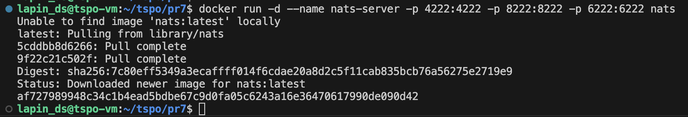
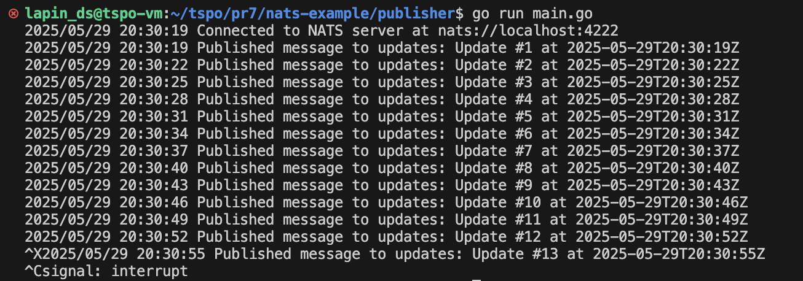
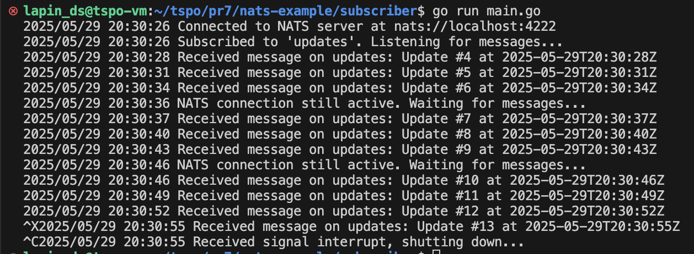

# NATS

Использование NATS в качестве системы обмена сообщениями по принципу публикации-подписки

## Описание

Издатель отправляет сообщение в тему "updated" каждые 3 секунды.
Подписчик прослушивает тему "updated" и регистрирует все полученные сообщения.

## Запуск

1. Запуск сервера NATS:
`docker run -d --name nats-server -p 4222:4222 -p 8222:8222 -p 6222:6222 nats`

2. Запуск subcriber в 1 терминале:
`go run main.go`

3. Запуск publisher в другом терминале:
`go run main.go`

## Скрины

Запуск контейнера

Запуск publisher

Запуск subscriber

