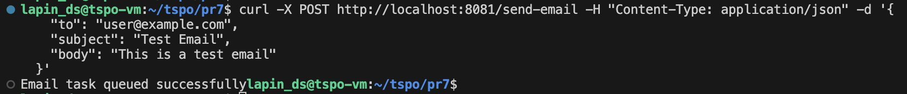
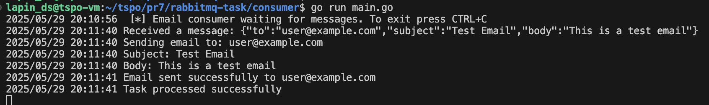
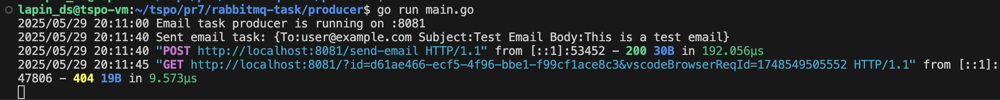

# RabbitMQ

Использование RabbitMQ в качестве посредника сообщений для обработки задач асинхронной отправки электронной почты с использованием ручного подтверждения обработки сообщений.

## Описание

1. Консьюмер предоставляет конечную точку HTTP, которая принимает сведения о задаче по электронной почте
2. При получении запроса задача сериализуется и помещается в очередь RabbitMQ
3. Потребитель прослушивает очередь и обрабатывает задачи по электронной почте по мере их поступления
4. Потребитель подтверждает получение сообщений только после успешной обработки

## Особенности реализации

- **Ручное подтверждение (manual ack)**: Сообщения подтверждаются только после успешной обработки
- **Отклонение сообщений (reject)**: В случае ошибки сообщение возвращается в очередь для повторной обработки
- **Долговечные сообщения (persistent messages)**: Сообщения сохраняются при перезагрузке сервера
- **Подтверждения издателя (publisher confirms)**: Гарантия доставки сообщений в очередь


## Запуск

1. Запуск контейнера RabbitMQ:
`docker run -d --hostname my-rabbit --name rabbit -p 5672:5672 -p 15672:15672 rabbitmq:3-management`

2. Запуск потребителя в 1 терминале:
`go run main.go`

3. Запуск производителя в другом терминале:
`go run main.go`

## Тесты

Отправка сообщения
```
curl -X POST http://localhost:8081/send-email
-H "Content-Type: application/json"
-d '{
"to": "user@example.com",
"subject": "Test Email",
"body": "This is a test email from RabbitMQ task queue"
}'
```

## Сценарии обработки

1. **Успешная обработка**: Сообщение подтверждается (ack) и удаляется из очереди
2. **Ошибка парсинга**: Сообщение отклоняется (reject) без повторной постановки в очередь
3. **Ошибка отправки**: Сообщение отклоняется (reject) и возвращается в очередь для повторной обработки

Для наглядности, потребитель имитирует случайные сбои в примерно 20% случаев обработки


### Скрины 

Отправка сообщения



Consumer



Producer


