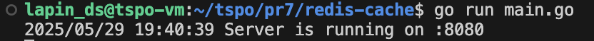
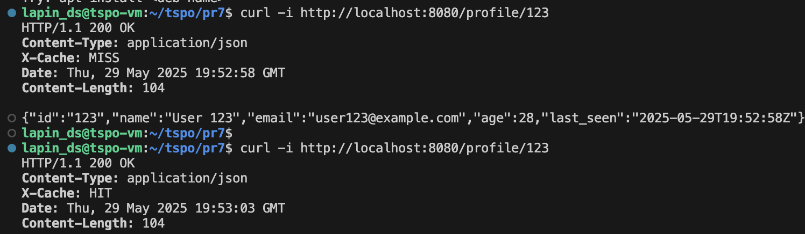
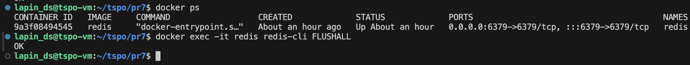
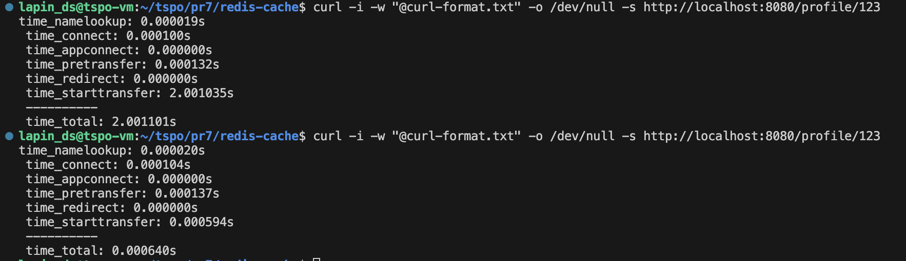

# Redis Cache

Использование Redis в качестве кэша для API профиля

## Запусе

1. Redis:
`docker run --name redis -p 6379:6379 -d redis`

2. main.go:
`go run main.go`

## Тесты

1. Запрос к эндпоинту профиля:
`curl http://localhost:8080/profile/123`

2. Сброс кеша в контейнере с redis
`docker exec -it redis redis-cli FLUSHALL`

Первый запрос будет выполняться медленно (2 секунды) и поступит из "медленного источника".
Последующие запросы в течение 10 минут будут выполняться быстро и обрабатываться из кэша Redis

- `X-Cache: MISS` - Данные получены из медленного источника
- `X-Cache: HIT` - Данные получены из кэша

### Скрины

Запуск сервера

Проверка кеша через curl с флагом -i

Сброс кеша в контейнере с redis

Проверка времени выполнения curl запроса через настройку формата из отдельного файла `curl-format.txt`

