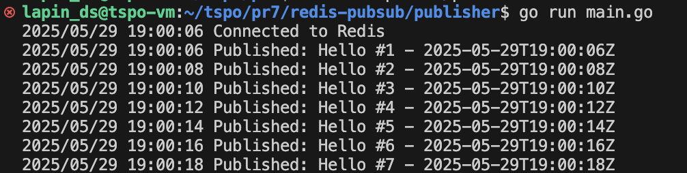

# Redis Pub/Sub

Пример работы pub и sub

## Описание

Паб отправляет сообщение в канал каждые 2 секунды
Саб прослушивает канал и получает сообщения

## Запуск

1. Запуск Redis:
`docker run --name redis -p 6379:6379 -d redis`

2. В 1 терминале запускаем подписчика:
`go run main.go`

3. В другом терминале запускаем публикатора:
`go run main.go`

## Тесты
### Скрины

Паб

Саб

